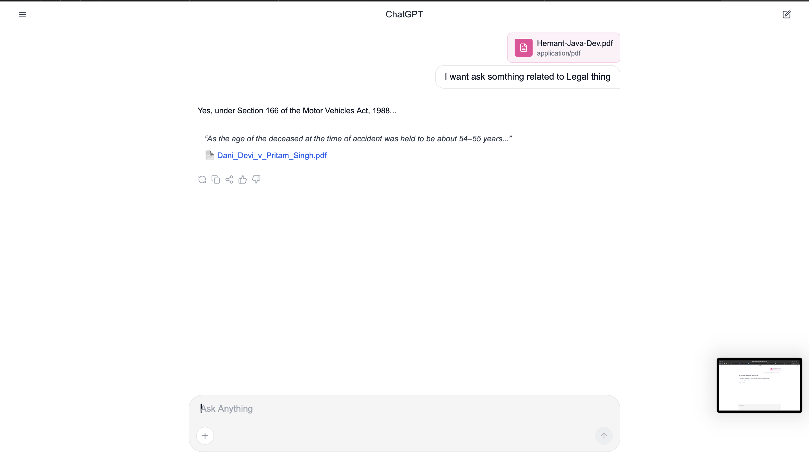

# Lexisg Frontend Intern Test

This project is a ChatGPT-style interface with legal AI assistant features, including citation linking and file previews.

---

## 🛠️ How to Run the Project

```bash
# Install dependencies
bun install

# Start the development server
bun run dev
```

Open [http://localhost:3000](http://localhost:3000) in your browser.

---

## 📎 Citation Linking Explained

When the AI responds with a message, it may include legal citations with metadata:

```ts
{
  answer: "Yes, under Section 166 of the Motor Vehicles Act...",
  citations: [
    {
      text: "Quote or paragraph from the judgment...",
      source: "Case_Law.pdf",
      link: "https://example.com/document.pdf"
    }
  ]
}
```

The citation is rendered in the message block as:

- Quoted text (`<blockquote>`)
- PDF file name (clickable)
- Link opens the document in a new tab

This mimics how legal research assistants present references in professional tools.

---

## 📸 Screenshot

> _Include a screenshot or screen recording of the app here._

 <!-- Replace with your actual screenshot path -->

---

## 📂 Features

- ChatGPT-style UI
- Upload and preview image or PDF files
- Citation block rendering with inline links
- Auto-expanding input with file attachment support
